# Agent harness: из каких модулей состоит агентная среда и где здесь Hermes

## От минимального Pi до сохраняемого состояния, многоагентной оркестрации, sandbox и самоизменяющегося runtime

**Версия:** v5.1  
**Дата проверки:** 10 августа 2026 года  
**Основной пример:** [Hermes Agent](https://github.com/NousResearch/hermes-agent) от Nous Research  
**Архитектурный ориентир:** [Pi](https://pi.dev/)  
**Аудитория:** технические специалисты, знакомые с LLM и имеющие начальное представление о агенты для работы с кодом.

Связанный материал:

- [справочное приложение v5.1](./hermes_agent_engineering_report_ru_v5_1_appendix.md).

---

## Результаты обучения

После чтения статьи читатель сможет:

1. объяснить разницу между LLM, агентом и harness;
2. разложить современный harness для работы с кодом на основные архитектурные модули;
3. на примере Pi проследить полный путь `ввод пользователя → контекст → LLM → tool → результат → следующий шаг`;
4. объяснить, почему Pi называется *minimal agent harness* и почему минимализм здесь означает небольшой обязательный набор правил, а не малое число возможностей;
5. отличить хранилище сессии, активный контекст, сжатие контекста, память и skills;
6. сравнить, как один и тот же модуль реализуют Pi, Hermes, Codex, Claude Code, Cline, Cursor и другие решения;
7. различать tools, среду исполнения, worktree и sandbox;
8. различать обычный subagent, команду агентов, Kanban с сохраняемым состоянием и внешний контур управления;
9. объяснить разницу между откатом разговора, checkpoint рабочего дерева, состоянием задач и восстановлением после перезапуска;
10. понять, какие дополнительные модули превращают минимальный harness для работы с кодом в долговременно работающую агентную систему;
11. описать место Hermes: открытая агентная среда с возможностью менять провайдера, сохраняемым состоянием, делегированием, Kanban, gateway и несколькими средами исполнения;
12. понять, почему Ouroboros представляет отдельную ось развития — изменение самого harness, а не просто увеличение числа subagent.

---

# 1. Модель, агент и harness — три разные вещи

LLM сама по себе решает задачу вида:

```text
входные сообщения
        ↓
     инференс
        ↓
ответ или запрос tool
```

Она не обязана знать:

- где расположен репозиторий;
- какие инструкции действуют в проекте;
- как читать и изменять файлы;
- как выполнить `pytest`;
- какие действия разрешены;
- что происходило в предыдущей сессии;
- как уменьшить переполненный контекст;
- как сохранить промежуточное состояние;
- как запустить subagent;
- когда считать работу законченной.

Чтобы модель стала агентом, вокруг неё появляется цикл действий и наблюдений:

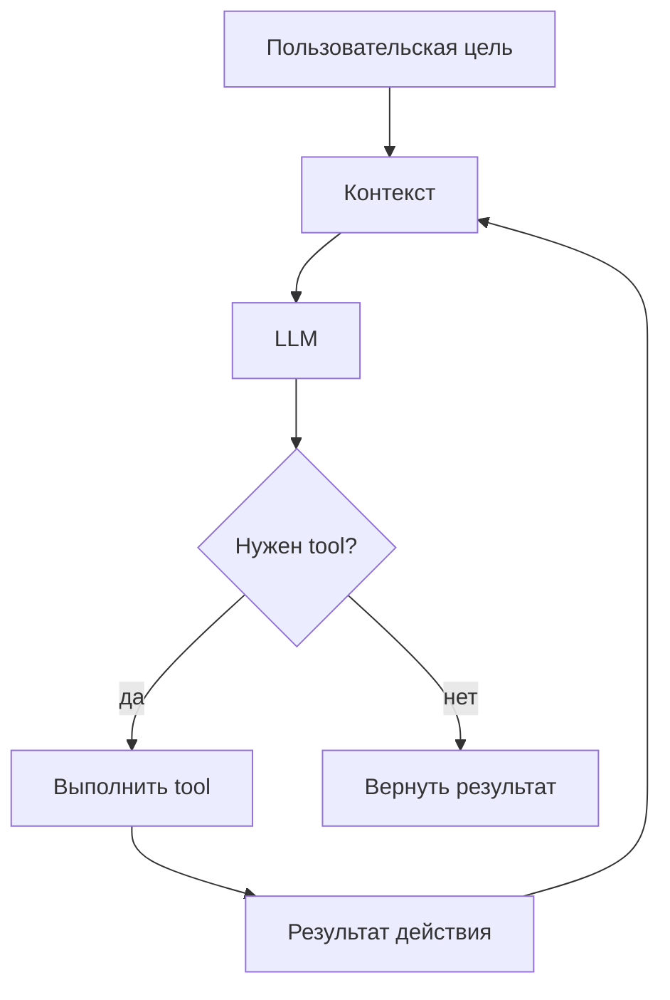

Программная среда, которая организует этот цикл, — **harness**.

Рабочее определение:

> **Harness — программная среда вокруг LLM, которая собирает контекст, вызывает модель, предоставляет и исполняет tools, хранит состояние, применяет ограничения и управляет жизненным циклом агентной работы.**

Практически полезный агент получается как композиция:

```text
модель
+ сборка контекста
+ agent loop
+ tools
+ среда исполнения
+ хранение состояния
+ интерфейс
+ правила
```

Более развитые harness добавляют:

```text
сжатие контекста
память
skills
checkpoint
subagent
общее состояние задач
gateway
фоновое выполнение
проверку результата
```

Эта статья рассматривает harness именно как **модульную программную систему**, а Hermes — как один из наиболее насыщенных вариантов такой системы.

---

# 2. Pi как разобранный на части эталонный harness

[Pi](https://pi.dev/) прямо называет себя *minimal agent harness*. Он особенно удобен для изучения архитектуры: вместо того чтобы начинать со сложной системы с памятью, gateway и многоагентной оркестрацией, можно сначала увидеть минимальный рабочий набор модулей.

Видео [PI Architecture EXPLAINED | Agent Loop, Tools, TUI and More](https://youtu.be/gTeujlv8qK0) полезно именно как последовательный разбор изнутри наружу:

```text
инициализация контекста
→ agent loop
→ выполнение tools
→ хранение сессии
→ сжатие контекста
→ TUI и другие интерфейсы
```

Для текущих деталей реализации далее используются официальные материалы Pi:

- [документация Pi](https://pi.dev/docs/latest);
- [README агент для работы с кодом](https://github.com/badlogic/pi-mono/blob/main/packages/coding-agent/README.md);
- [сжатие контекста](https://pi.dev/docs/latest/compaction);
- [расширения](https://pi.dev/docs/latest/extensions).

## 2.1 Минимализм Pi означает «минимум обязательных правил»

Неверное чтение:

```text
Pi минимален
= умеет мало
```

Более точное:

```text
Pi минимален
= ядро навязывает мало обязательных решений
```

Pi сознательно держит обязательную часть небольшой, а значительную долю поведения предлагает добавлять через:

```text
расширения TypeScript
skills
шаблоны промптов
темы
пакеты
```

В частности, сложная оркестрация subagent, отдельный режим планирования, дополнительные правила подтверждений, собственная интеграция MCP или особая логика checkpoint не обязаны быть частью ядра.

> **Минимальный harness — не «урезанный богатый harness». Это harness, который старается отделить необходимый механизм agent loop от необязательных правил и расширений.**

## 2.2 Интерфейс управления: откуда приходит ввод

Пользователь видит TUI, но TUI не является самим agent loop.

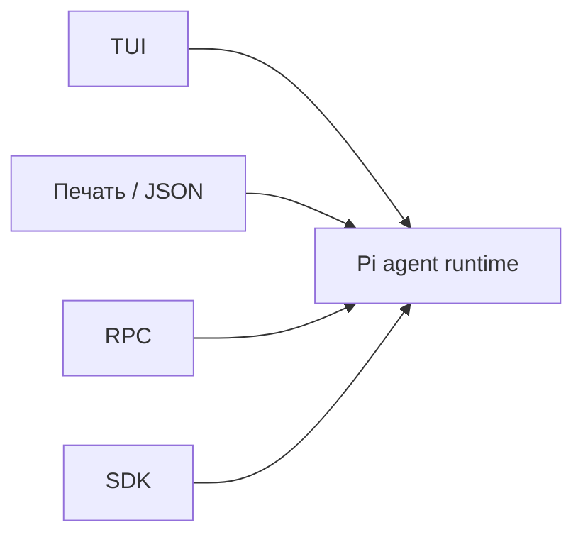

Одна и та же агентная среда может работать через несколько интерфейсов.

```text
интерфейс управления
≠
agent runtime
```

### Параллели

| Harness | Характерные интерфейсы |
|---|---|
| **Pi** | TUI, режим вывода JSON, RPC, SDK |
| **Hermes** | CLI, Desktop/Web, API, gateway, мессенджеры |
| **Codex** | CLI, IDE, приложение, облачные режимы, app-server |
| **Claude Code** | терминал, IDE и программные интеграции |
| **Cursor** | IDE остаётся основной границей продукта |
| **OpenClaw** | gateway и мессенджеры являются центральной частью эксплуатации |

## 2.3 Сборка контекста: что модель увидит перед первым вызовом

Перед вызовом LLM harness должен собрать вход модели:

```text
системный промпт
+ инструкции проекта
+ история текущей сессии
+ схемы tools
+ выбранные skills
+ текущий запрос
```

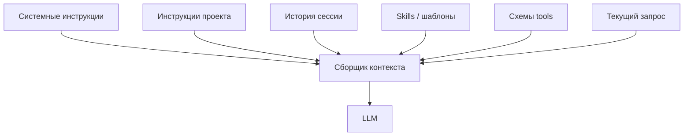

> **Размер контекстного окна задаёт модель; решение, чем заполнить это окно, принимает harness.**

### Параллели

| Решение | Характерная реализация |
|---|---|
| **Pi** | небольшой слой инструкций проекта, skills и данных от расширений |
| **Hermes** | инструкции проекта + сессия + память + skills + схемы tools |
| **Codex** | инструкции проекта и контекст конкретной среды; важная точка — `AGENTS.md` |
| **Claude Code** | `CLAUDE.md`, правила, skills и отдельный контекст subagent |
| **Cursor** | правила проекта плюс тесная связь с контекстом IDE и репозитория |

## 2.4 Agent loop: маленькое ядро

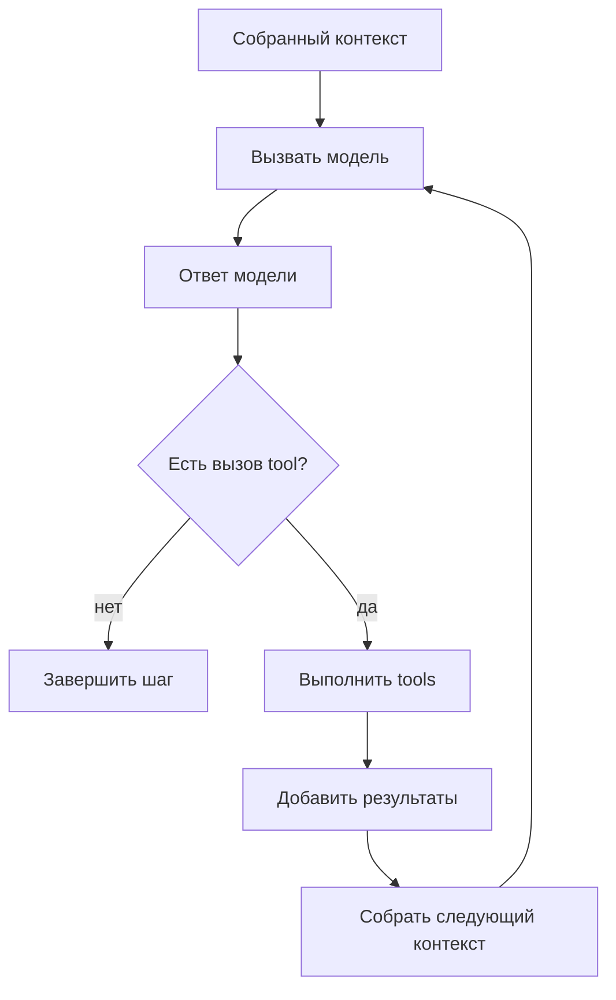

Harness решает:

- как вызвать провайдера;
- как разобрать запрос tool;
- в каком порядке выполнить tools;
- что записать в историю;
- когда сделать повторную попытку;
- когда остановиться.

**Pi** стремится держать agent loop небольшим и расширяемым.

**Hermes** строит более насыщенный `AIAgent`: вокруг центрального agent loop находятся сборка промпта, диспетчеризация tools, выбор провайдера, резервные модели, обратные вызовы и tools с состоянием.

**Codex** и **Claude Code** используют нативные agent loop, тесно связанные с собственными моделями, tools и правилами безопасности.

```text
универсальный расширяемый agent loop
                vs
agent loop, оптимизированный вместе с моделью вендора
```

## 2.5 Tools: возможность не живёт внутри модели

В базовой конфигурации Pi предоставляет небольшой набор tools для работы с кодом: чтение, запись, редактирование, командная оболочка и компактные средства поиска по файлам.

Модель не «сама умеет открыть файл». Harness:

1. описывает схему tool;
2. помещает её в контекст;
3. получает запрос;
4. проверяет аргументы;
5. выполняет действие;
6. возвращает модели результат.

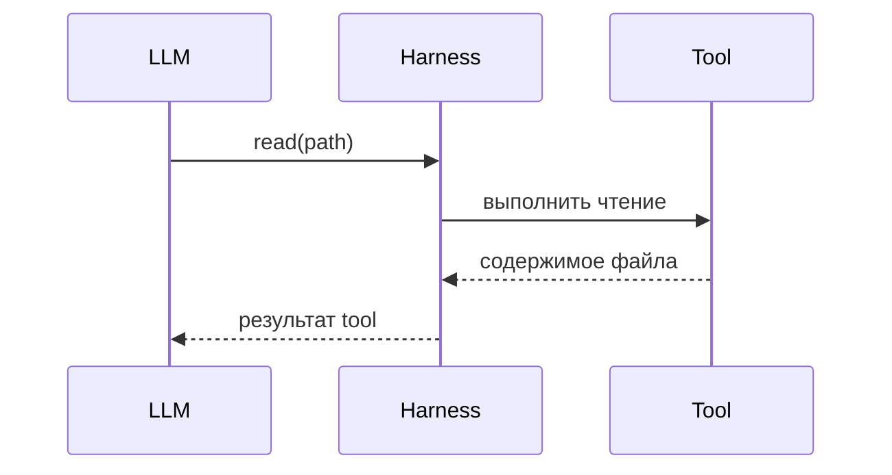

### Параллели

| Подход | Пример |
|---|---|
| Небольшой встроенный набор tools | **Pi** |
| Большой настраиваемый реестр tools | **Hermes** |
| Нативные tools для работы с кодом | **Codex**, **Claude Code** |
| Действия, связанные с IDE | **Cursor** |
| Стандартизированные внешние возможности | **MCP** |
| Расширения, регистрирующие новые tools | **Pi**, OpenCode, Cline |

## 2.6 Дерево сессии: хранилище не равно активному контексту

Pi сохраняет траекторию сессии и позволяет разговору ветвиться:

```text
шаг A
  ↓
шаг B
  ├── ветвь C1
  │     ↓
  │   шаг D1
  │
  └── ветвь C2
        ↓
      шаг D2
```

```text
хранилище сессии
≠
активный контекст модели
```

и:

```text
ветвь разговора
≠
checkpoint рабочего дерева
```

### Параллели

| Harness | Хранение сессии |
|---|---|
| **Pi** | локальные файлы сессии и древовидная история |
| **Hermes** | сохраняемые сессии с продолжением и поиском |
| **Codex** | сессии/threads и несколько сред выполнения |
| **Claude Code** | продолжение сессии и механизмы откат/checkpoint |
| **OpenClaw** | долговременные сессии как часть runtime gateway |

## 2.7 Сжатие контекста

```text
полная старая история
██████████████████████████████

            ↓

активный контекст
[сводка ███][последние шаги ███████][tools ██]
```

Старая история может оставаться в хранилище сессии, но в новый запрос модели вместо неё входит компактная сводка.

> **Управление контекстом отвечает на вопрос «что модель видит сейчас», а хранение сессии — «что вообще происходило».**

Параллели:

- **Pi**: автоматическое и ручное сжатие контекста;
- **Hermes**: сжатие контекста и отдельные вспомогательные модели для некоторых операций;
- **Claude Code / Codex**: собственные механизмы управления контекстом;
- **subagent**: дополнительный способ изолировать большой исследовательский след и вернуть родителю короткий вывод.

## 2.8 Расширения: место, куда Pi выносит необязательную сложность

Расширения Pi могут:

```text
регистрировать новые tools
блокировать или менять вызовы tools
добавлять контекст
менять логику сжатия
добавлять команды
добавлять элементы интерфейса
```

```text
ядро Pi
   │
   ├── расширение: дополнительные проверки
   ├── расширение: subagent
   ├── расширение: другая логика сжатия
   ├── расширение: checkpoint
   └── расширение: удалённое исполнение
```

Поэтому отсутствие функции в ядре Pi ещё не означает отсутствие такой функции в его экосистеме.

### Параллель с Hermes

В Hermes значительная часть этой сложности уже оформлена как штатная часть среды:

```text
память
skills
делегирование
Kanban
gateway
checkpoint
резервные провайдеры
несколько сред терминала
```

Pi скорее говорит:

> «Собери именно тот harness, который тебе нужен».

Hermes скорее говорит:

> «Вот богатая агентная среда; настрой и отключи лишнее».

## 2.9 Skills, шаблоны и расширения — разные уровни

| Механизм | Что хранит |
|---|---|
| **Инструкция проекта** | постоянное правило проекта |
| **Шаблон промпта** | повторно используемый пользовательский запрос |
| **Skill** | процедурное знание, загружаемое по необходимости |
| **Память** | долговременный факт или контекст |
| **Расширение** | исполняемый код, меняющий поведение harness |

Pi особенно хорошо показывает разницу между процедурным содержанием и кодовым расширением. Hermes, в свою очередь, делает память и skills центральными механизмами сохраняемого состояния.

## 2.10 Зачем Pi нужен в этой статье

Pi выступает **эталонным harness**, позволяющим увидеть минимальную цепочку:

```text
интерфейс
→ контекст
→ модель/провайдер
→ agent loop
→ tools
→ результаты
→ хранилище сессии
→ сжатие
→ точки расширения
```

После этого можно задать главный вопрос:

> **Какие дополнительные модули разные вендоры встраивают поверх этого ядра, а какие оставляют внешней системе?**

---

# 3. Универсальная модульная модель harness

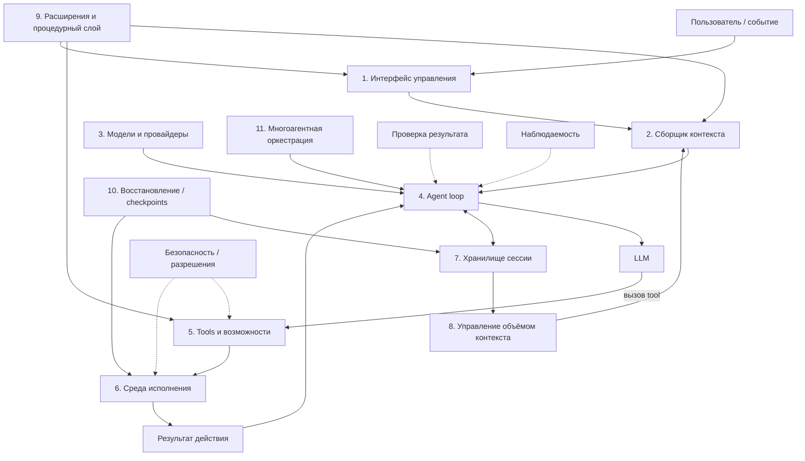

Не каждый harness реализует все блоки внутри себя.

Например:

```text
Pi:
часть сложности остаётся расширениям и внешней среде

Codex:
sandbox является штатным модулем

Devin:
VM является частью управляемой среды исполнения

Hermes:
память, Kanban, gateway и checkpoint встроены

Multica:
координация находится выше конкретного harness
```

Именно **местоположение модуля** часто важнее наличия галочки в таблице возможностей.

---

# 4. Один модуль — разные реализации

## 4.1 Интерфейс управления

**Вопрос:** откуда приходит задача и где пользователь наблюдает ход работы?

- **Pi**: TUI, JSON/RPC/SDK;
- **Hermes**: CLI, Desktop/Web, API, gateway;
- **Cursor**: IDE является основной точкой взаимодействия;
- **OpenClaw**: gateway и мессенджеры — важная часть модели эксплуатации;
- **Multica**: интерфейс находится над несколькими разными агентными runtime.

## 4.2 Модели и провайдеры

**Вопрос:** кто превращает «вызвать модель» в конкретный протокол, авторизацию и запрос инференса?

**Pi** использует абстракцию провайдера, позволяющую менять модели без переписывания agent loop.

**Hermes** добавляет:

```text
выбор провайдера
пулы учётных данных
резервные модели и провайдеры
вспомогательные модели
совместимые пользовательские точки доступа
```

**Codex** и **Claude Code** выбирают более вертикальную интеграцию: модель, tools и agent loop оптимизируются одним вендором.

```text
переносимость и возможность менять провайдера
                    vs
глубокая нативная интеграция модели и harness
```

## 4.3 Сборщик контекста

- **Pi**: инструкции проекта, системный промпт, история сессии, схемы tools, skills и данные расширений;
- **Hermes**: к этому добавляются штатная память, более развитая работа со skills и центральный механизм сборки контекста;
- **Claude Code**: `CLAUDE.md`, правила, skills и контексты отдельных агентов;
- **Codex**: `AGENTS.md` и контекст нативной среды;
- **Cursor**: тесная связь с состоянием IDE и репозитория.

```text
размер контекстного окна
= свойство модели

сборка контекста
= свойство harness
```

## 4.4 Agent loop

- **Pi**: небольшой расширяемый agent loop;
- **Hermes**: `AIAgent` с более богатой диспетчеризацией, провайдерами и tools с состоянием;
- **Codex / Claude Code**: нативные agent loop, тесно связанные с собственными моделями и tools.

## 4.5 Tools

- **Pi**: небольшой встроенный набор tools для работы с кодом и расширения;
- **Hermes**: настраиваемый реестр файловых, терминальных и веб/браузерных, tools памяти, skills и делегирования; MCP подключает внешние возможности;
- **Codex / Claude Code**: собственные нативные tools для работы с кодом;
- **Cursor**: действия тесно связаны с IDE.

```text
tool
≠
среда исполнения
```

## 4.6 Среда исполнения

- **Pi**: ядро не навязывает тяжёлую схему изоляции;
- **Hermes**: локальный, Docker, SSH и удалённые среды терминала;
- **Codex локально**: штатный sandbox уровня ОС;
- **Claude Code**: sandbox и worktree как разные механизмы;
- **облачные агенты Cursor**: управляемая удалённая среда;
- **управляемые агенты Devin**: отдельная VM на каждого управляемого дочернего агента;
- **OpenClaw**: область Docker можно задавать на уровне агента, сессии или общей среды.

## 4.7 Хранилище сессии

```text
сессия
= журнал конкретной траектории

память
= отобранное знание для будущих траекторий
```

## 4.8 Управление объёмом контекста

subagent иногда является **механизмом управления контекстом**, даже если не ускоряет задачу по времени.

## 4.9 Процедуры и расширения

```text
skill
= процедура для модели

расширение
= исполняемый код, меняющий harness
```

## 4.10 Восстановление и checkpoint

Возможны разные уровни:

```text
откат разговора
checkpoint рабочего дерева
Git commit
состояние задач
перезапуск процесса
```

Наличие `/resume` нельзя считать эквивалентом checkpoint рабочего дерева.

## 4.11 Многоагентная оркестрация

Pi не включает её в обязательное ядро. Hermes предоставляет `delegate_task`, Kanban и Kanban swarm. Claude Code и Cline развивают команды агентов с общим состоянием задач и обменом сообщениями; Codex делает сильное родительское делегирование subagent; Devin использует координатора и дочерние VM; Multica выносит координацию выше отдельных harness.

---

# 5. Hermes как конкретная сборка этих модулей

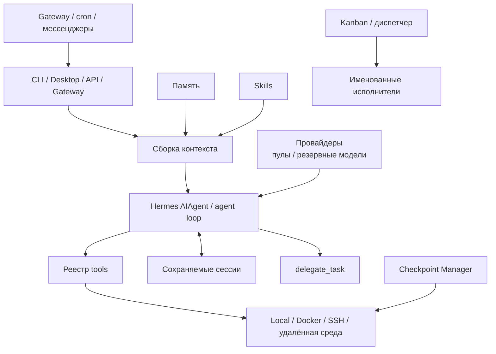

Pi:

```text
маленькое обязательное ядро
+ точки расширения
```

Hermes:

```text
agent loop
+ сохраняемое состояние
+ развитый слой провайдеров
+ больше tools
+ оркестрация
+ восстановление
+ gateway и автоматизация
```

Hermes — не «следующее поколение Pi». Это другая граница между **ядром** и **системой вокруг ядра**.

---

# 6. Сохраняемое состояние: не одна память, а несколько слоёв

## 6.1 Сессия

> Что происходило в конкретной траектории?

## 6.2 Активный контекст

> Что LLM видит прямо сейчас?

## 6.3 Память

> Какие факты стоит принести в будущую работу?

## 6.4 Skill

> Какую процедуру стоит повторно использовать?

```text
память:
"проект использует uv"

skill:
"как диагностировать проблему зависимостей в проекте с uv"
```

Pi особенно наглядно разделяет историю сессии, сжатие контекста, skills, шаблоны и исполняемые расширения.

---

# 7. Модели, провайдеры и резервирование в Hermes

Пользователь может настраивать:

- основную модель;
- вспомогательные модели;
- учётные данные;
- резервные модели;
- резервных провайдеров;
- совместимые пользовательские точки доступа.

```text
пул учётных данных
= другой credential того же провайдера

резервный провайдер
= переход к другой модели или сервису

вспомогательная модель
= отдельная модель для побочной операции
```

Вертикальные решения выбирают другую стратегию: Codex и Claude Code получают меньше переносимости, но могут глубже согласовывать модель, tools и нативный runtime.


---

# 8. Оркестрация: от одного agent loop к нескольким

subagent — не отдельный класс интеллекта.

Это прежде всего:

> **ещё один agent loop с отдельным контекстом и состоянием, жизненным циклом которого управляет другой слой.**

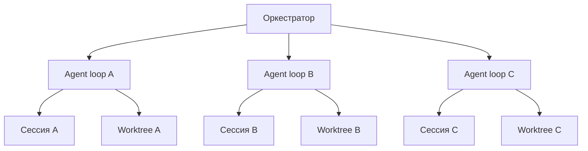

Главные вопросы оркестрации:

1. кто декомпозирует цель;
2. как создаются исполнители;
3. могут ли они работать параллельно;
4. где хранится общее состояние задач;
5. могут ли исполнители обмениваться сообщениями напрямую;
6. что происходит при падении;
7. как интегрируются результаты;
8. где физически работает каждый исполнитель.

## 8.1 Разветвление и сборка

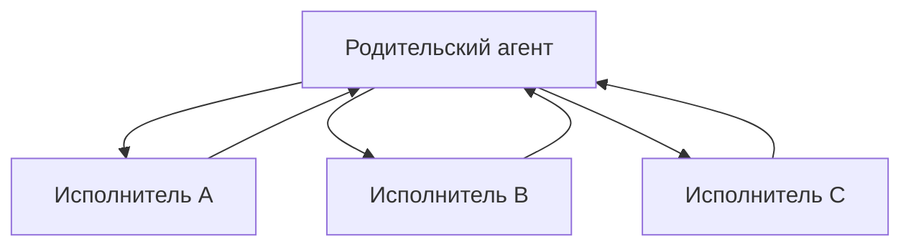

Характерные примеры:

- Hermes `delegate_task`;
- Codex subagents;
- многие исследовательские сценарии.

Здесь родительский агент сам предотвращает дублирование работы.

## 8.2 Hermes `delegate_task`

Дочерний агент получает свежий контекст и выполняет ограниченную подзадачу; родитель получает краткий результат.

Преимущества:

```text
изоляция контекста
специализация ролей
параллельное исследование
независимая проверка
```

Но это не очередь задач с сохраняемым состоянием. Работа дочернего агента связана с текущим процессом и сессией.

## 8.3 Команда агентов: общее состояние задач и обмен сообщениями

Другой подход:

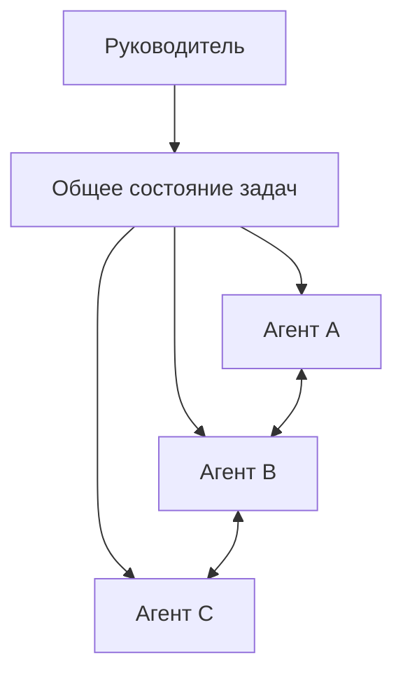

Наиболее наглядные примеры:

- **Claude Code Agent Teams** — общий список задач и сообщения между участниками;
- **Cline Agent Teams** — общая доска и обмен сообщениями между агентами.

Так исполнители могут видеть, что работа уже занята другим агентом, и передавать друг другу найденные ограничения.

## 8.4 Hermes Kanban: общая доска и очередь с сохраняемым состоянием

Hermes Kanban хранит состояние задач в отдельной SQLite-системе.

Например:

```text
задача
статус
исполнитель
зависимости
комментарии
история запусков
heartbeat
число повторных попыток
рабочая область
```

Принципиальное отличие:

```text
delegate_task
= временный вызов дочернего агента

Kanban
= объект работы существует независимо от конкретного процесса-исполнителя
```

Комментарии и передача работы образуют общую историю координации.

## 8.5 Kanban swarm

Вспомогательная команда swarm строит заранее заданный граф:

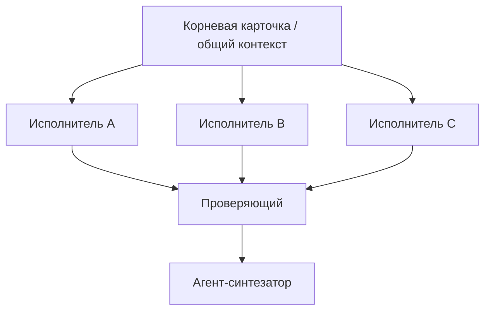

Это не отдельная «роевая магия», а готовая схема поверх Kanban с сохраняемым состоянием.

## 8.6 Другие варианты оркестрации

| Harness | Характерная схема |
|---|---|
| **Codex** | родительский агент + subagents; сильное автоматическое разветвление задачи |
| **Claude Code** | subagents + Agent Teams с общими задачами и сообщениями |
| **Cline** | Agent Teams + отдельный Kanban/интерфейс worktree |
| **Cursor** | асинхронная декомпозиция задач внутри IDE/облачного режима |
| **GitHub Copilot** | оркестрация вокруг GitHub, CLI и облачных задач |
| **Devin** | координатор → управляемые дочерние агенты в отдельных VM |
| **Factory** | оркестратор → исполнители → проверяющие |
| **OpenClaw** | сессии + обмен сообщениями + программируемая оркестрация |
| **ядро Pi** | оркестрация не входит в обязательное ядро |
| **Multica** | внешний контур задач над разными agent CLI |

---

# 9. Изоляция: несколько разных значений слова «отдельный агент»

Нельзя писать просто:

```text
subagent isolated: yes
```

Нужно уточнять, **что именно изолировано**.

| Уровень | Что разделяет | Чего не гарантирует |
|---|---|---|
| **Контекст** | историю разговора и tools | отдельные файлы |
| **Сессия/процесс** | состояние выполнения | отдельное рабочее дерево |
| **Worktree** | отдельную рабочую копию Git и набор изменений | границу безопасности |
| **OS sandbox** | доступ по правилам ОС | отдельную машину |
| **Контейнер** | пространство файлов и процессов | безопасность при опасных подключениях каталогов и расширенных правах |
| **VM** | отдельную гостевую среду | правильность действий агента |

### Точки сравнения

- **Codex локально**: OS sandbox как штатный механизм;
- **Claude Code**: sandbox и worktree — разные механизмы;
- **Hermes**: несколько сред исполнения, включая Docker и SSH;
- **облачные агенты Cursor**: управляемое удалённое выполнение;
- **управляемые агенты Devin**: отдельная VM на дочернего агента;
- **OpenClaw**: область Docker можно задавать на уровне агента/сессии/общей среды;
- **Pi**: изоляция в значительной степени оставлена внешней среде или расширениям.

### Hermes и Docker

Docker среда исполнения не означает автоматически:

```text
один subagent = один контейнер
```

Несколько дочерних задач могут использовать общий долговременно работающий контейнер, если схема исполнения специально не разделена.

Для параллельной работы с кодом, где несколько исполнителей меняют файлы, обычно нужна отдельная стратегия рабочих областей — например worktree.

---

# 10. Длинная задача — это маленькая распределённая система

Длинную задачу нельзя свести к:

```text
большое контекстное окно
+ больше времени
```

Нужно отдельно решить несколько проблем:

| Проблема | Механизм |
|---|---|
| Контекст разрастается | сжатие и сводки |
| Есть независимые ветви исследования | subagents |
| Исполнители конфликтуют в файлах | worktrees |
| Работа идёт дольше одной UI-сессии | фоновое выполнение |
| Исполнитель может умереть | состояние задач + повторный запуск + переназначение |
| Нужно объединить результаты | проверяющий + интегратор |
| Ошибочные правки нужно отменить | checkpoint / Git |
| Опасные действия нужно ограничить | sandbox / разрешения |

Поэтому:

> **Длинный harness для работы с кодом начинает приобретать свойства движка рабочих процессов и распределённой системы.**

Именно здесь различие Pi и Hermes наиболее наглядно: минимальный agent loop не обязан решать долговременную координацию; Hermes специально добавляет для неё Kanban, gateway и механизмы восстановления.

---

# 11. Checkpoint и восстановление

Слово checkpoint перегружено.

Полезно различать:

```text
откат разговора
checkpoint рабочего дерева
состояние графа задач
восстановление исполнителя
```

## 11.1 Hermes Checkpoint Manager

Hermes использует отдельное теневое Git-хранилище и позволяет вернуть охваченные файлы к прошлой точке, не засоряя обычную историю Git проекта.

Это не универсальная транзакция: внешние вызовы API, удалённые побочные эффекты или операции вне рабочего дерева автоматически не отменяются.

## 11.2 Параллели

| Harness | Механизм восстановления |
|---|---|
| **Hermes** | Checkpoint Manager на отдельном Git-хранилище |
| **Claude Code** | откат разговора и кода |
| **Cline** | checkpoints на основе Git |
| **Roo Code** | теневое Git-хранилище |
| **GitHub Copilot CLI** | откат/откат |
| **ядро Pi** | не обязательный модуль; можно добавить расширением |
| **Codex** | сессии/threads и worktree; аналог Hermes Checkpoint Manager не является центральным механизмом |
| **OpenClaw** | сильнее выражено сохранение сессий, чем снимки файловой системы |
| **Multica** | откат в основном остаётся обязанностью нижележащего harness/Git |

### Четыре разных вида восстановления

```text
откат разговора
→ вернуть состояние рассуждения

откат рабочего дерева
→ вернуть файлы

сохранение задач
→ помнить, что ещё нужно сделать

восстановление исполнителя
→ решить, кто продолжит работу после сбоя
```

Одна команда `/resume` не заменяет все четыре.

---

# 12. Gateway, автоматизация и превращение CLI в службу

Ещё один модуль, отсутствующий в минимальном ориентире, — **постоянно работающий интерфейс к агентной среде**.

Hermes может работать через gateway и адаптеры мессенджеров, а задания по расписанию — через cron и вебхуки.

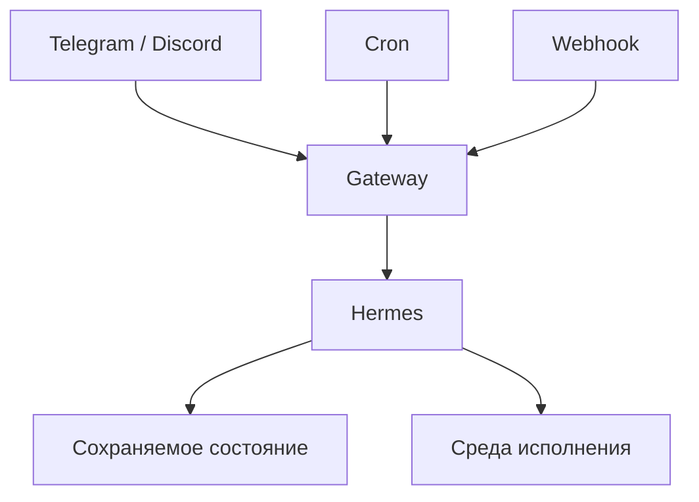

Меняется сам режим эксплуатации:

```text
"я запустил CLI"
        ↓
"агентная служба доступна постоянно"
```

### Параллели

- **OpenClaw** также явно ориентирован на долговременно работающий gateway и сессии;
- **Codex / Cursor / Devin** решают фоновое и облачное выполнение через собственные управляемые сервисы;
- **Pi** можно встроить в серверную систему через программные интерфейсы, но постоянно работающий gateway не является обязательной частью продукта.

---

# 13. Hermes + Codex App-Server Runtime: замена не модели, а внутренней среды

Codex App-Server Runtime особенно хорошо объясняется после модульного разбора.

### Нативный путь Hermes

```text
контекст Hermes
→ Hermes AIAgent / agent loop
→ tools Hermes
→ среда исполнения Hermes
```

### Путь через Codex

```text
внешний слой Hermes
→ Codex app-server
→ agent loop Codex
→ tools Codex
→ sandbox Codex
```

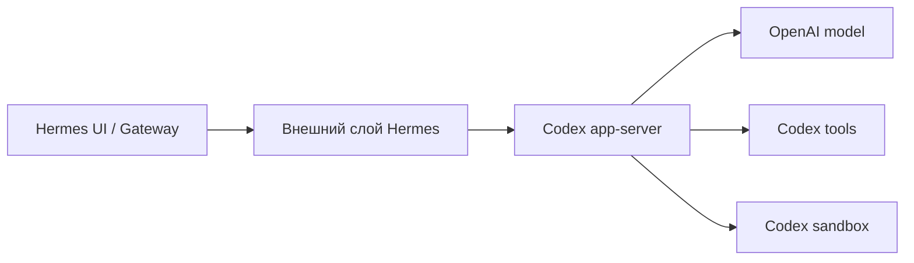

То есть речь уже не просто о:

```text
провайдер A
→ провайдер B
```

а о:

```text
внутренняя агентная среда A
→ внутренняя агентная среда B
```

Внутри хода Codex модель не получает прямой доступ ко всему набору tools Hermes, например `delegate_task`, `memory`, `session_search` и Hermes `todo`.

Это один из наиболее интересных признаков превращения harness в **составную агентную среду**, внутри которой можно менять не только модель, но и целый нативный agent runtime.

---

# 14. Раздел о качестве работы harness — намеренно оставлен незаполненным

## 14.1 Что хотелось бы проверить

Разные harness потенциально могут влиять на:

- долю задач, принятых без ручной переделки;
- количество лишних вызовов tools;
- стоимость API/подписки;
- число вмешательств человека;
- долю ложных сообщений «готово»;
- дублирование работы subagent;
- конфликты при интеграции;
- восстановление после сбоев;
- объём ручной правки итогового изменений.

Но текущий материал **не содержит собственного контролируемого сравнения**, достаточного для утверждений вида:

```text
"этот harness пишет код лучше"
"память улучшает результат"
"subagents экономят деньги"
"нативный runtime лучше универсального"
```

Поэтому такие выводы здесь намеренно не делаются.

## 14.2 Что нужно, чтобы заполнить этот раздел

Нужна отдельная оценка:

```text
одни и те же реальные задачи репозитория
× фиксированные критерии приёмки
× одинаковые настройки моделей
× несколько harness
× сохранённые траектории работы
```

Минимальные метрики:

```text
доля принятых задач
полное время выполнения
стоимость
вмешательства человека
ложное завершение
падения тестов
проверка итогового изменений
дублирование работы subagent
конфликты интеграции
откат / восстановление
```

До такого сравнения этот раздел остаётся **заготовкой для будущего исследования**, а не заполняется общими рассуждениями.

---

# 15. Практическая карта выбора архитектуры

Не рейтинг продуктов, а выбор механизмов.

| Если требуется... | Нужный механизм |
|---|---|
| Простой интерактивный агент для работы с кодом | минимальный agent loop |
| Контроль структуры собственного harness | небольшое ядро + расширения |
| Смена моделей и провайдеров | абстракция провайдера |
| Процедуры между сессиями | skills |
| Долговременные факты | память |
| Исследовать несколько ветвей без загрязнения основного контекста | subagents |
| Исполнители должны видеть, кто чем занят | общее состояние задач |
| Исполнители должны напрямую договариваться | обмен сообщениями между агентами |
| Работа должна переживать перезапуск процесса | очередь задач с сохраняемым состоянием |
| Параллельные изменения кода | worktrees |
| Ограничить доступ к машине | OS/контейнер/VM sandbox |
| Откатить правки | checkpoint / Git |
| Запускать с телефона/VPS | gateway + фоновое выполнение |
| Управлять разными agent CLI | внешний контур управления |


---

# 16. Hermes и Multica: похожие механизмы на разных уровнях

Hermes Kanban уже умеет:

```text
задачи
статусы
зависимости
именованные профили
комментарии
историю запусков
повторные попытки
переназначение
рабочие области
```

Поэтому он частично заходит на территорию локального контура управления.

Но Multica находится уровнем выше:

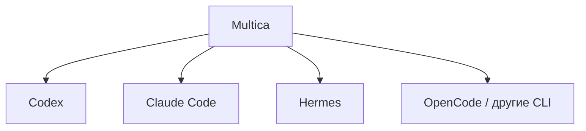

Упрощённо:

```text
Hermes Kanban
= координация с сохраняемым состоянием внутри Hermes

Multica
= координация разных harness и людей
```

Исполнение и sandbox конкретной задачи в Multica в значительной степени остаются свойствами нижележащего runtime.

---

# 17. Ouroboros: отдельная ось — изменение самого harness

До этого дополнительные возможности добавлялись вокруг относительно стабильной агентной среды.

Например Hermes:

```text
опыт
→ память / skill
→ следующая сессия использует накопленное
```

Ouroboros интересен другой постановкой:

```text
агент
→ предлагает изменить промпты / tools / логику среды
→ детерминированные тесты
→ независимая проверка
→ gate
→ новая версия harness
```

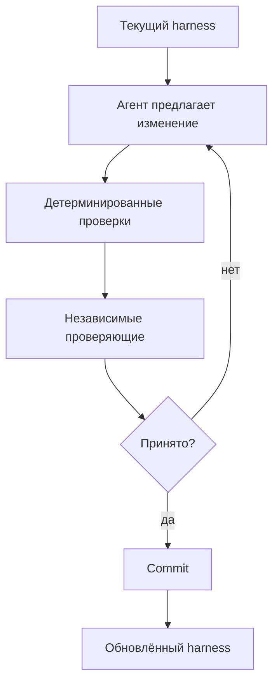

Это не «более высокий уровень многоагентности» в одной линейной лестнице.

Это другая ось:

```text
фиксированный runtime
→ runtime с расширениями
→ самоизменяющийся runtime
→ контролируемая эволюция harness
```

---

# 18. Несколько независимых осей развития harness

Единой шкалы:

```text
autocomplete → agent → multi-agent → super-agent
```

недостаточно.

### Ось A — масштаб оркестрации

```text
один agent loop
→ разветвление на subagents
→ команда агентов
→ очередь задач с сохраняемым состоянием
→ внешний контур управления
```

### Ось B — сохранение состояния

```text
один ход
→ сессия
→ сжатие контекста
→ память
→ checkpoint
→ граф задач с сохраняемым состоянием
→ восстановление
```

### Ось C — изоляция исполнения

```text
общая рабочая область
→ отдельный процесс
→ worktree
→ sandbox
→ контейнер
→ VM
```

### Ось D — адаптивность runtime

```text
фиксированное ядро
→ расширения
→ skills / память
→ составной runtime
→ контролируемое самоизменение
```

Pi, Hermes, Codex, Claude Code, Devin, Multica и Ouroboros занимают разные позиции сразу на нескольких осях.

---

# 19. Где находится Hermes

На август 2026 года наиболее полезная формулировка:

> **Hermes — открытая агентная среда с возможностью менять провайдера, сохраняемыми сессиями, памятью и skills, несколькими средами исполнения, `delegate_task`, локальным Kanban с сохраняемым состоянием, checkpoints и gateway; дополнительно он умеет использовать Codex app-server как альтернативный внутренний runtime для агент для работы с кодом.**

Это делает Hermes более насыщенным, чем минимальный harness.

Но он не становится автоматически:

```text
лучшим агент для работы с кодом
распределённой многоузловой платформой
универсальным корпоративным контуром управления
```

Особенно важно помнить:

- Kanban остаётся в первую очередь локальной на одном хосте архитектурой;
- `delegate_task` и Kanban решают разные задачи жизненного цикла;
- Docker среда исполнения не гарантирует контейнер на каждого subagent;
- память и skills требуют управления и проверки;
- композиция с Codex имеет чёткую границу доступных tools;
- более сложный harness означает больше состояния, правил и эксплуатационной поверхности.

---

# 20. Быстрый старт с Hermes

Linux/macOS/WSL2:

```bash
curl -fsSL https://hermes-agent.nousresearch.com/install.sh | bash
```

Windows PowerShell:

```powershell
iex (irm https://hermes-agent.nousresearch.com/install.ps1)
```

В корпоративной среде удалённый установщик разумно сначала скачать, проверить и зафиксировать версию.

Базовые команды:

```bash
hermes setup --portal
hermes model
hermes doctor
hermes
```

Первая задача должна быть ограниченной и желательно только для чтения:

```text
Проведи обзор репозитория только для чтения.
Ничего не изменяй.

Сначала прочитай инструкции проекта.
Опиши архитектуру, входные точки
и проверки, которые понадобятся
перед изменением кода.
```

Gateway, cron, мессенджеры, исполнителей Kanban и автономный режим стоит добавлять только после того, как обычный локальный agent loop понятен и предсказуем.

---

# 21. Что читать дальше

## Pi и минимальная архитектура

- [Pi](https://pi.dev/)
- [документация Pi](https://pi.dev/docs/latest)
- [README агент для работы с кодом](https://github.com/badlogic/pi-mono/blob/main/packages/coding-agent/README.md)
- [сжатие контекста](https://pi.dev/docs/latest/compaction)
- [расширения](https://pi.dev/docs/latest/extensions)
- [PI Architecture EXPLAINED | Agent Loop, Tools, TUI and More](https://youtu.be/gTeujlv8qK0)

## Hermes

- [Hermes Agent](https://github.com/NousResearch/hermes-agent)
- [архитектура](https://github.com/NousResearch/hermes-agent/blob/main/website/docs/developer-guide/architecture.md)
- [agent loop](https://github.com/NousResearch/hermes-agent/blob/main/website/docs/developer-guide/agent-loop.md)
- [делегирование](https://github.com/NousResearch/hermes-agent/blob/main/website/docs/user-guide/features/делегирование.md)
- [Kanban](https://github.com/NousResearch/hermes-agent/blob/main/website/docs/user-guide/features/kanban.md)
- [checkpoints](https://github.com/NousResearch/hermes-agent/blob/main/website/docs/user-guide/checkpoints-and-откат.md)
- [Codex App-Server Runtime](https://github.com/NousResearch/hermes-agent/blob/main/website/docs/user-guide/features/codex-app-server-runtime.md)

Подробные ссылки на Codex, Claude Code, Cline, Cursor, OpenClaw, Devin, Multica и подписки провайдеров вынесены в [приложение](./hermes_agent_engineering_report_ru_v5_1_appendix.md).

---

# 22. Итог

Самая полезная модель после всего разбора:

```text
LLM
 ↓
адаптер модели / провайдера
 ↓
сборщик контекста
 ↓
agent loop
 ↓
tools
 ↓
среда исполнения
 ↓
результаты действий
 ↺
```

Вокруг этого ядра появляются:

```text
хранилище сессии
сжатие контекста
расширения
skills
память
разрешения
checkpoint
subagents
очереди задач с сохраняемым состоянием
gateway
проверка результата
```

Pi показывает, как мало этой сложности обязательно должно жить в ядре.

Hermes показывает противоположный инженерный выбор: значительную часть этих модулей предоставить как штатную агентную среду.

Поэтому главный вопрос при сравнении продуктов должен звучать не:

> «У кого больше функций?»

а:

> **«Где находится каждый архитектурный модуль, кто им управляет и какие свойства система гарантирует на его границе?»**

Тогда становится понятна разница между:

```text
расширением Pi
skill Hermes
sandbox Codex
Agent Teams Claude
Kanban Hermes
VM Devin
доской Multica
самоизменением Ouroboros
```

Это не разные названия одной функции. Это **разные модули и разные уровни одной агентной системы**.
