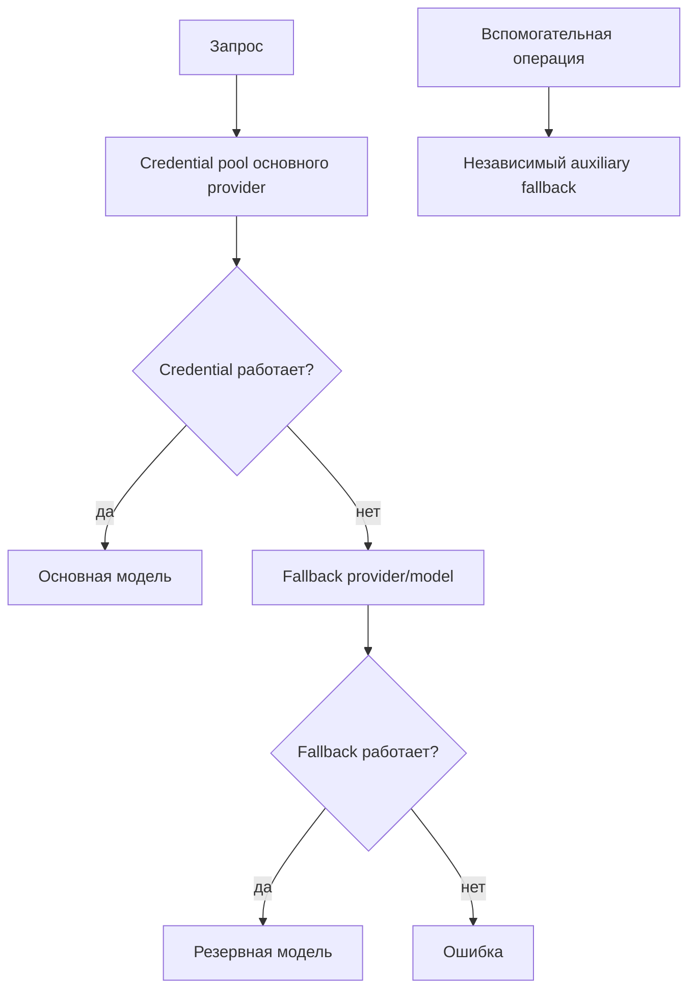
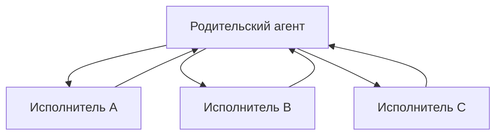
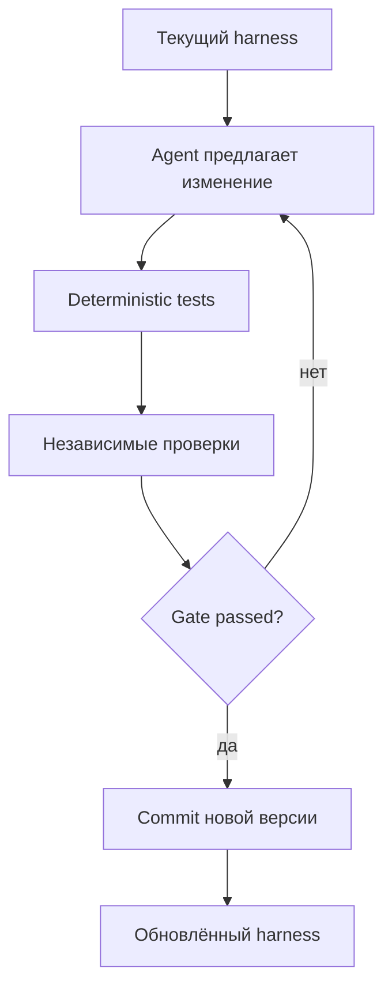

# Справочное приложение к отчёту об agent harness и Hermes Agent

**Версия:** v5.1
**Дата проверки:** 10 августа 2026 года
**Основной документ:** [Agent harness: как среда работы меняет возможности агента и где здесь Hermes](./hermes_agent_engineering_report_ru_v5_1.md)

Это справочный документ. Его разделы можно читать независимо. Быстро меняющиеся сведения — команды, тарифы, OAuth-пути и ограничения продуктов — снабжены датой проверки и ссылками на первичные источники.

## Правило терминологии v5.1

В основном тексте и приложении без принудительного перевода оставлены:

```text
harness
agent loop
tools
MCP
skills
subagent
runtime
worktree
sandbox
checkpoint
gateway
Kanban
CLI / TUI / IDE
human-in-the-loop
```

Для остальных повторяющихся понятий используется русская форма. В частности:


| Не использовать        | Предпочтительно                                     |
| -------------------------------------- | -------------------------------------------------------------------- |
| persistent session                   | сессия, сохраняемая между запусками |
| durable task                         | задача с сохраняемым состоянием        |
| provider flexibility                 | возможность менять провайдера           |
| shared task state                    | общее состояние задач                           |
| background execution                 | фоновое выполнение                                |
| worker recovery                      | восстановление работы исполнителя   |
| peer messaging                       | обмен сообщениями между агентами      |
| runtime в обычной прозе | среда исполнения / агентная среда      |

`runtime` остаётся без перевода в устойчивых названиях и там, где перевод ухудшает точность, например **Codex App-Server Runtime**.

---

# A. Словарь


| Термин                                    | Значение в этом отчёте                                                                                                                               |
| ------------------------------------------------- | ------------------------------------------------------------------------------------------------------------------------------------------------------------------------- |
| **LLM**                                         | модель, которая получает сообщения и генерирует ответ или tool call                                                    |
| **Agent**                                       | LLM, включённая в цикл действий и наблюдений                                                                                          |
| **Agent harness**                               | среда вокруг модели: context, tools, permissions, состояние, интерфейсы и правила выполнения                      |
| **Agent loop**                                  | повторяющийся цикл «модель → tool → результат → модель»                                                                      |
| **Tool**                                        | операция, которую модель может запросить: прочитать файл, запустить команду, вызвать API         |
| **Provider**                                    | сервис или endpoint, выполняющий inference модели                                                                                             |
| **Основная модель**               | модель, которая ведёт главную сессию и принимает решения                                                                |
| **Вспомогательная модель** | модель для сжатия, vision, summarization, поиска skills и других побочных задач                                                |
| **Fallback**                                    | переход к другой модели или provider после ошибки или исчерпания текущего                                        |
| **Credential pool**                             | несколько credentials одного provider с правилами ротации                                                                               |
| **Session**                                     | сохраняемая история сообщений и tool calls одного разговора                                                                  |
| **Память**                                | отобранные долговременные сведения, автоматически доступные в будущих сессиях                      |
| **Skill**                                       | загружаемая по необходимости инструкция о повторяемой процедуре                                                |
| **Subagent**                                    | отдельный agent context, выполняющий ограниченную подзадачу                                                                    |
| **Orchestration**                               | декомпозиция, назначение, координация, восстановление и объединение работы агентов              |
| **Worktree**                                    | отдельный Git checkout/branch для изоляции изменений файлов                                                                          |
| **Sandbox**                                     | техническая граница доступа к файлам, процессам и сети                                                                    |
| **Checkpoint**                                  | восстановимая точка состояния рабочего дерева или разговора                                                        |
| **Gateway**                                     | долговременно работающий процесс, связывающий agent loop с внешними платформами                            |
| **Human-in-the-loop**                           | участие человека в подтверждении, разблокировке или принятии результата                                  |
| **Control plane**                               | внешний слой, который распределяет и наблюдает задачи между несколькими агентными средами |

Термины `persistent`, `durable`, `runtime` и `peer messaging` в основном русском тексте по возможности заменяются выражениями «сохраняется между запусками», «с сохраняемым состоянием», «среда исполнения» и «обмен сообщениями между агентами».

---

# B. Полная модульная карта harness

```mermaid
flowchart TD
    H["Agent harness"]

    H --> LOOP["Agent loop"]
    LOOP --> PB["Prompt/context builder"]
    LOOP --> STOP["Stop/retry policy"]
    LOOP --> COMP["Compression/caching"]

    H --> MOD["Models/providers"]
    MOD --> MAIN["Основная модель"]
    MOD --> AUX["Вспомогательные модели"]
    MOD --> POOL["Credential pools"]
    MOD --> FALL["Fallback chain"]

    H --> TOOL["Tools"]
    TOOL --> FS["Files/Git"]
    TOOL --> TERM["Terminal"]
    TOOL --> WEB["Web/browser"]
    TOOL --> MCP["MCP/integrations"]

    H --> STATE["Сохраняемое состояние"]
    STATE --> SES["Sessions"]
    STATE --> MEM["Memory"]
    STATE --> SK["Skills"]
    STATE --> TASK["Task state"]

    H --> ORCH["Orchestration"]
    ORCH --> DEL["delegate_task"]
    ORCH --> KAN["Kanban"]
    ORCH --> SW["Kanban swarm"]

    H --> SURF["Интерфейсы"]
    SURF --> CLI["CLI/Desktop/API"]
    SURF --> MSG["Telegram/Discord"]
    SURF --> AUTO["Cron/webhooks"]

    H --> CROSS["Сквозные свойства"]
    CROSS --> ISO["Изоляция"]
    CROSS --> SEC["Безопасность"]
    CROSS --> REC["Checkpoints/recovery"]
    CROSS --> OBS["Наблюдаемость"]
    CROSS --> VER["Verification"]
```



## B.1 Минимальный и богатый harness


| Слой                                    | Pi core                                | Hermes                                                              |
| --------------------------------------------- | ---------------------------------------- | --------------------------------------------------------------------- |
| Agent loop                                  | ядро продукта              | ядро`AIAgent`                                                   |
| Базовые tools                        | `read`, `write`, `edit`, `bash`        | registry из нескольких toolsets                         |
| Сессии                                | есть                               | SQLite/FTS5, resume/search                                          |
| Память                                | не обязательное ядро | встроенный/подключаемый слой              |
| Skills                                      | через Skills/Packages             | центральная процедура с progressive disclosure |
| Subagents                                   | не встроены в core          | `delegate_task`                                                     |
| Долговременная очередь | не встроена                  | Kanban                                                              |
| Gateway/messaging                           | не встроен                    | отдельный модуль                                     |
| Cron/webhooks                               | не встроены                  | через gateway                                                  |
| Среды терминала               | среда/расширения        | local, Docker, SSH и удалённые среды                 |

Pi сознательно не включает built-in subagents, plan mode и permission popups. Это не отсутствие возможностей ecosystem, а решение о размере ядра.

## B.2 Те же модули у разных harness

Эта таблица дополняет architecture-first модель основного текста. Она показывает не «у кого больше функций», а **где конкретный модуль находится в product boundary**.


| Модуль                  | Pi                                                                    | Hermes                                         | Контрастные реализации                                      |
| ------------------------------- | ----------------------------------------------------------------------- | ------------------------------------------------ | ---------------------------------------------------------------------------------- |
| Control surface               | TUI / print / RPC / SDK                                               | CLI / Desktop / API / Gateway                  | Cursor — IDE-first; OpenClaw — gateway-first                                   |
| Provider layer                | multi-provider abstraction                                            | resolver + pools + fallback + auxiliary models | Codex/Claude — более вертикальная интеграция         |
| Контекст construction | system/project context + skills/extensions                            | project context + session + memory + skills    | Cursor добавляет IDE-derived context                                    |
| Agent loop                    | минимальный extensible core                                | `AIAgent` с rich runtime policy               | Codex/Claude — vendor-tuned native loops                                        |
| Tools                         | маленький built-in coding set + extensions                   | configurable registry + MCP/toolsets           | native coding tools у Codex/Claude                                              |
| Execution                     | в значительной степени external/extension concern | local / Docker / SSH / remote backends         | Devin — VM-per-managed-child                                                    |
| Session state                 | local session tree/files                                              | persisted searchable sessions                  | OpenClaw — long-lived gateway sessions                                          |
| Compaction                    | auto/manual compaction                                                | context compression + auxiliary paths          | implementation proprietary harness раскрыта неодинаково       |
| Procedural extension          | skills/templates/extensions/packages                                  | memory + skills + profiles/toolsets            | Cline/OpenCode также model-agnostic/customizable                            |
| Recovery                      | не обязательный core primitive                          | shadow-Git Checkpoint Manager                  | Claude/Cline/Roo — собственные rewind/checkpoint approaches          |
| Orchestration                 | extension/package concern                                             | `delegate_task` + Kanban + swarm               | Claude/Cline teams; Devin coordinator; Multica контур управления |

Главная интерпретация:

```text
Pi:
необязательная complexity чаще остаётся за extension boundary

Hermes:
многие дополнительные модули входят в first-party runtime

Codex / Claude:
часть модулей тесно связана с native model/runtime stack

Multica:
coordination вынесена выше конкретного harness
```

Источники:

- [Pi Coding Agent README](https://github.com/earendil-works/pi/tree/main/packages/coding-agent#readme)
- [Hermes Architecture](https://github.com/NousResearch/hermes-agent/blob/main/website/docs/developer-guide/architecture.md)
- [Hermes Agent Loop](https://github.com/NousResearch/hermes-agent/blob/main/website/docs/developer-guide/agent-loop.md)

---

# C. Контекст, sessions, memory и skills

## C.1 Какие данные получает модель

Hermes prompt builder может включать:

- `SOUL.md`;
- `MEMORY.md` и `USER.md`;
- project context files: `.hermes.md`, `AGENTS.md`, `CLAUDE.md`, `.cursorrules`;
- историю текущей сессии;
- описания доступных skills;
- выбранный skill целиком;
- схемы tools;
- результаты tool calls.

Не все данные должны входить в каждый запрос. Progressive disclosure и context compression уменьшают вход, но могут потерять значимые детали. Для важных ограничений надёжнее хранить их в стабильных project instructions и acceptance criteria, а не надеяться на старый conversational turn.

## C.2 Сессии

Hermes автоматически сохраняет сообщения, tool calls, модель и snapshot системных инструкций в `~/.hermes/state.db` (SQLite/FTS5). Сессии можно продолжать и искать. После сжатия новая ветвь сохраняет связь с исходной историей.

Сохранение сессий не означает, что вся история каждый раз помещается в контекст модели. Storage и active context — разные слои.

Источник: [Сессии](https://github.com/NousResearch/hermes-agent/blob/main/website/docs/user-guide/sessions.md).

## C.3 Память

Встроенная memory поддерживает операции добавления, замены и удаления. Чтение происходит не отдельным tool call: актуальная memory подставляется в system context.

Параметр `memory.write_approval` управляет подтверждением изменений. Существенная оговорка: подтверждение записи выключено по умолчанию. Без изменения конфигурации нельзя говорить, что каждая новая запись проходит одобрение человека.

## C.4 Skills и фоновая проверка

Skills находятся в `~/.hermes/skills/`. Agent-created skill может быть создан, изменён или удалён самим агентом.

После сессии фоновая проверка может запустить отдельный `AIAgent`, передать ему полную запись или краткое содержание разговора и разрешить ограниченный набор memory/skill tools. Такая проверка не меняет основной разговор и его кэш запросов.

Защитные настройки:

```yaml
skills:
  write_approval: true
  guard_agent_created: true

memory:
  write_approval: true
```

Точные имена и значения нужно сверять с текущей configuration reference. По состоянию на дату проверки `skills.write_approval`, `memory.write_approval` и scanner для agent-created skills выключены по умолчанию.

Источники:

- [Память](https://github.com/NousResearch/hermes-agent/blob/main/website/docs/user-guide/features/memory.md)
- [Skills](https://github.com/NousResearch/hermes-agent/blob/main/website/docs/user-guide/features/skills.md)
- [Configuration](https://github.com/NousResearch/hermes-agent/blob/main/website/docs/user-guide/configuration.md)

---

# D. Модели, providers, pools и fallback

## D.1 Разрешение provider

Общий provider resolver используется CLI, gateway, cron, ACP и вспомогательными вызовами. В упрощённом виде приоритет такой:

```text
явный параметр текущего запуска
→ сохранённая конфигурация
→ environment variables
→ defaults provider
```

## D.2 Три уровня устойчивости



1. Credential pool меняет credential внутри одного provider.
2. Primary fallback меняет provider или модель основной сессии.
3. Auxiliary fallback применяется независимо для побочной операции.

Ротация credential после 429/402 или неудачного OAuth refresh помогает продолжить работу, но новый account/key может не иметь provider-side prompt cache. Следующий запрос заново прочитает полный context по обычной цене.

Источники:

- [Provider Runtime](https://github.com/NousResearch/hermes-agent/blob/main/website/docs/developer-guide/provider-runtime.md)
- [Credential Pools](https://github.com/NousResearch/hermes-agent/blob/main/website/docs/user-guide/features/credential-pools.md)
- [Fallback Providers](https://github.com/NousResearch/hermes-agent/blob/main/website/docs/user-guide/features/fallback-providers.md)

---

# E. Taxonomy orchestration

## E.1 Fork/join

Родительский агент создаёт независимых исполнителей и ожидает их краткие отчёты.



Применение: ограниченное исследование, чтение журналов, независимая проверка. Hermes `delegate_task` относится прежде всего к этой модели.

## E.2 Руководитель и исполнители

Оркестратор декомпозирует цель, назначает роли и собирает результат. Исполнители не обязательно общаются друг с другом.

Применение: задачи с понятными этапами и центральной интеграцией.

## E.3 Agent team

Исполнители имеют общую очередь и могут обмениваться сообщениями. Claude Code Agent Teams и Cline Teams служат примерами.

Преимущество: участник может сообщить peer о найденном ограничении. Риск: coordination traffic и неопределённая ownership.

## E.4 Durable queue/Kanban

Task state находится не только в LLM context, а в отдельной БД:

```text
todo / ready / running / blocked / triage / done
assignee
dependencies
comments
heartbeat
retry count
artifacts
```

Hermes Kanban — пример локальной очереди с сохраняемым состоянием. Диспетчер работает внутри gateway и обычно проверяет задачи каждые 60 секунд. Именованный профиль исполнителя запускается отдельным процессом ОС.

Ограничения:

- система single-host;
- SQLite local;
- tenant — мягкий фильтр, board — более сильная логическая граница;
- remote/Docker workspace требует корректных mounts;
- dashboard нельзя бездумно открывать наружу.

## E.5 Kanban swarm

Swarm helper создаёт DAG, а не новый распределённый движок:

```text
root/blackboard
→ N параллельных карточек исполнителей
→ verifier
→ synthesizer
```

Общий контекст хранится как structured comments на root card. Каждый узел выполняется обычным Kanban dispatcher.

## E.6 External контур управления

Multica хранит задачи и очередь, а через daemon запускает одну из разных агентных сред. Безопасная формулировка:

> Внешний слой управления над разнородными агентными средами и людьми.

`Control plane` здесь — аналитический термин, а не обязательно официальное самоназвание Multica.

Источники:

- [Hermes Delegation](https://github.com/NousResearch/hermes-agent/blob/main/website/docs/user-guide/features/delegation.md)
- [Hermes Delegation Patterns](https://github.com/NousResearch/hermes-agent/blob/main/website/docs/guides/delegation-patterns.md)
- [Hermes Kanban](https://github.com/NousResearch/hermes-agent/blob/main/website/docs/user-guide/features/kanban.md)
- [Multica: how it works](https://multica.ai/docs/how-multica-works)

---

# F. Изоляция и среда исполнения

## F.1 Уровни изоляции


| Уровень   | Изолирует                           | Не изолирует автоматически                                           |
| ------------------ | ---------------------------------------------- | ---------------------------------------------------------------------------------------------- |
| Контекст | conversation/tool history                    | процессы, файлы, network                                                        |
| Session/process  | состояние процесса          | общий home, credentials, workspace                                                      |
| Worktree         | Git checkout и branch                       | остальные paths и процессы host                                            |
| OS sandbox       | paths, процессы, network по policy | отдельный kernel/machine                                                            |
| Container        | filesystem/process namespace                 | host при опасных mounts/capabilities                                               |
| VM               | гостевую ОС и ресурсы      | логические ошибки и утечки через разрешённую сеть |

## F.2 Среды терминала Hermes

Официально документируются local, Docker, SSH, Singularity, Modal и Daytona; некоторые материалы по безопасности также упоминают дополнительные sandbox-среды. Доступность зависит от установленной версии и дополнительных компонентов.

Local используется по умолчанию и не создаёт OS isolation. Процесс действует с правами пользователя.

## F.3 Docker caveat

Среда Docker в Hermes — один долговременный контейнер для процесса Hermes. Команды терминала, операции с файлами и `execute_code` вызываются внутри него через `docker exec`.

Следствия:

- зависимости сохраняются между calls;
- разные sessions/subagents могут видеть один container state;
- это не container-per-task;
- переданные env vars доступны коду внутри контейнера;
- read-only credential mounts всё равно позволяют прочитать credential;
- dangerous-command checker может не применяться так же, как в local режиме, поскольку контейнер считается границей.

Источник: [Hermes Docker](https://github.com/NousResearch/hermes-agent/blob/main/website/docs/user-guide/docker.md).

## F.4 Reference points


| Продукт       | Характерная граница                                                  |
| ---------------------- | ---------------------------------------------------------------------------------------- |
| Codex local          | OS-enforced sandbox, обычно workspace write и ограниченная сеть |
| Codex cloud          | managed container/environment                                                          |
| Cursor               | worktrees; Cloud Agents/Agents Window для удалённой работы           |
| Claude Code          | sandbox policy и optional worktrees; Agent Teams отдельно                     |
| Cline Kanban         | ephemeral worktree на card; среда остаётся зависимой от host |
| Devin Managed Devins | отдельная VM на каждого managed child                                |
| OpenClaw             | настраиваемый Docker scope agent/session/shared                           |
| Pi                   | isolation остаётся внешней среде или extensions                 |

Worktree и sandbox нельзя объединять в одну колонку «isolated» без пояснения.

---

# G. Checkpoints и recovery

## G.1 Четыре состояния

```text
conversation state
workspace state
task graph state
execution state
```

Resume conversation восстанавливает только первый слой. Worktree изолирует часть второго. Kanban хранит третий. Heartbeat/reclaim помогает четвёртому.

## G.2 Hermes checkpoints

Checkpoint Manager:

- opt-in и выключен по умолчанию;
- включается `hermes chat --checkpoints` или настройкой `checkpoints.enabled: true`;
- использует shadow Git store `~/.hermes/checkpoints/store/`;
- не меняет настоящий `.git` проекта;
- создаёт не более одного checkpoint на directory/turn;
- реагирует на `write_file`, `patch` и некоторые распознанные destructive shell patterns;
- позволяет list/diff/restore через rollback workflow.

Это не универсальный backup и не транзакция всех внешних side effects. Не распознанная команда, внешний API, DB или отправленное сообщение могут остаться вне rollback.

Источник: [Checkpoints and Rollback](https://github.com/NousResearch/hermes-agent/blob/main/website/docs/user-guide/checkpoints-and-rollback.md).

## G.3 Сравнение механизмов


| Механизм                | Что возвращает                                    |
| --------------------------------- | ---------------------------------------------------------------- |
| Сжатие контекста | компактное представление истории |
| Conversation rewind             | более раннее состояние разговора  |
| Workspace checkpoint            | файлы до изменений                             |
| Git commit                      | явную версию проекта                         |
| Worktree                        | независимый checkout                                |
| Kanban DB                       | состояние задач и handoffs                      |
| Process supervisor              | перезапуск процесса                          |
| External backup                 | данные после потери host/storage              |

---

# H. Три migration checklist

## H.1 От IDE-помощника

Цель: перейти от управления отдельными правками к управлению задачами.

Checklist:

- [ ]  выбрать 5–10 реальных задач с проверяемым результатом;
- [ ]  описывать цель, ограничения и `done_when`;
- [ ]  дать агенту только требуемые tools;
- [ ]  начать с read-only исследования;
- [ ]  использовать отдельный worktree для изменений;
- [ ]  запускать repo-level tests;
- [ ]  сравнить wall time, cost и human interventions с IDE workflow;
- [ ]  не отказываться от IDE: она остаётся удобным интерфейсом проверки и отладки.

## H.2 От Codex к Hermes + Codex App-Server

- [ ]  установить и проверить обычный Hermes;
- [ ]  настроить OpenAI Codex auth;
- [ ]  включить режим Codex App-Server;
- [ ]  проверить доступные Codex tools и migrated MCP/plugins;
- [ ]  учитывать отсутствие `delegate_task`, `memory`, `session_search` и Hermes `todo` в активном ходе Codex;
- [ ]  отдельно проверить фоновую обработку памяти и skills;
- [ ]  проверить gateway и режим исполнителя Kanban;
- [ ]  сравнить результат с native Codex session на одинаковой задаче;
- [ ]  уметь вернуться в auto/native Hermes mode.

Источники и команды:

- [Режим Codex App-Server](https://github.com/NousResearch/hermes-agent/blob/main/website/docs/user-guide/features/codex-app-server-runtime.md)
- `/codex-runtime codex_app_server`
- `/codex-runtime auto`

## H.3 С локального CLI на VPS

- [ ]  выбрать отдельного пользователя без sudo по умолчанию;
- [ ]  настроить SSH keys и обновления системы;
- [ ]  установить Hermes и проверить `hermes doctor`;
- [ ]  выбрать subscription/API путь и лимиты расходов;
- [ ]  настроить `HERMES_HOME` и backups;
- [ ]  ограничить network и secrets;
- [ ]  запустить gateway под supervisor/system service;
- [ ]  подключить один messaging channel;
- [ ]  включить allowlist пользователей/чатов;
- [ ]  дать платформе минимальный toolset;
- [ ]  проверить `/stop`, approvals и аварийное отключение;
- [ ]  только затем добавить cron/webhooks;
- [ ]  настроить logs, storage monitoring и обновление Hermes;
- [ ]  провести recovery drill после перезапуска VPS.

---

# I. Пользовательские подписки и Hermes

## I.1 Методика классификации

В таблице ниже **не считаются**:

- обычный API key с отдельным pay-as-you-go балансом;
- OpenRouter credits;
- custom endpoint, оплачиваемый отдельно от подписки;
- факт технической совместимости модели без подтверждённого subscription billing.

Статусы:


| Статус                      | Значение                                                                                             |
| ----------------------------------- | -------------------------------------------------------------------------------------------------------------- |
| **Да**                          | официальный subscription/token-plan путь расходует лимиты плана           |
| **Условно**                | нужен конкретный tier, endpoint или entitlement; часть metering не раскрыта |
| **Нет**                        | подписка не переносится; доступен только отдельный API/PAYG      |
| **Не подтверждено** | Hermes умеет войти, но расход квоты плана официально не описан |

## I.2 Подробная таблица


| План                      | Статус                                      | Как подключается                        | Ограничения                                                                                                                                 |
| ------------------------------- | --------------------------------------------------- | -------------------------------------------------------- | -------------------------------------------------------------------------------------------------------------------------------------------------------- |
| Nous Portal                   | **Да**                                          | `hermes setup --portal` / OAuth                        | модель и Tool Gateway оплачиваются подпиской Nous                                                                          |
| ChatGPT/Codex                 | **Да**                                          | OpenAI Codex device-code OAuth                         |                                                                                                                                                        |
| Claude Pro                    | **Нет**                                        | —                                                     | Hermes OAuth path не поддерживает Pro quota                                                                                              |
| Claude Max                    | **Нет для включённой квоты** | Anthropic OAuth                                        | работает только Max + отдельно приобретённые usage credits; это дополнительное consumption billing |
| GitHub Copilot                | **Да**                                          | device OAuth/token или Copilot ACP                  | доступно по Copilot plan; для org seat требуется разрешение Copilot CLI policy                                         |
| Cursor subscription           | **Нет**                                        | —                                                     | Cursor не предоставляет Hermes portable subscription endpoint; BYOK тратит upstream API                                           |
| Perplexity Pro/Max/Enterprise | **Нет**                                        | custom Perplexity API                                  | API access и billing отделены от web subscription                                                                                           |
| Z.AI GLM Coding Plan          | **Да, условно**                          | `GLM_API_KEY`, coding base URL                         | нужен coding endpoint и модель, включённая в tier; general endpoint может быть PAYG                                    |
| Alibaba/Qwen Coding Plan      | **Да**                                          | `ALIBABA_CODING_PLAN_API_KEY`, plan endpoint           | использовать`sk-sp-*`; general `sk-*` и endpoint означают другой billing                                                    |
| Sakana Fugu                   | **Да через custom provider**               | `https://api.sakana.ai/v1`, subscription key           | Hermes не имеет named provider; доступность по регионам, включая ограничение EU/EEA                      |
| Kimi membership/Kimi Code     | **Да**                                          | Kimi Code endpoint`https://api.kimi.com/coding/v1`     | general Moonshot endpoint может использовать PAYG; модели K3 зависят от membership tier                                |
| MiniMax Token/Coding Plan     | **Да**                                          | OAuth или plan key и Anthropic-compatible endpoint | plan keys отличаются от PAYG; global/China endpoints различаются                                                                |
| xAI SuperGrok/Premium+        | **Условно**                                | `xai-oauth`                                            | tier allowlisting может дать 403; inference metering через Hermes раскрыт не полностью                                 |
| OpenCode Go                   | **Да**                                          | `OPENCODE_GO_API_KEY`                                  | использует limits Go plan; optional Zen fallback может быть PAYG                                                                    |

## I.3 Ключевые источники

### Hermes

- [AI Providers](https://hermes-agent.nousresearch.com/docs/integrations/providers)
- [Nous Portal](https://hermes-agent.nousresearch.com/docs/integrations/nous-portal)
- [MiniMax OAuth](https://hermes-agent.nousresearch.com/docs/guides/minimax-oauth)
- [xAI Grok OAuth](https://hermes-agent.nousresearch.com/docs/guides/xai-grok-oauth)

### Providers

- [OpenAI: Using Codex with a ChatGPT plan](https://help.openai.com/en/articles/11369540-using-codex-with-your-chatgpt-plan)
- [Anthropic usage credits](https://support.claude.com/en/articles/12429409-manage-usage-credits-for-paid-claude-plans)
- [GitHub Copilot CLI authentication](https://docs.github.com/en/copilot/how-tos/copilot-cli/set-up-copilot-cli/authenticate-copilot-cli)
- [Perplexity enterprise billing FAQ](https://www.perplexity.ai/help-center/en/articles/10352986-enterprise-pricing-and-billing-frequently-asked-questions)
- [Z.AI Coding Plan quick start](https://docs.z.ai/devpack/quick-start)
- [Alibaba Coding Plan FAQ](https://www.alibabacloud.com/help/en/model-studio/coding-plan-faq)
- [Sakana Fugu](https://sakana.ai/fugu/)
- [Kimi Code documentation](https://www.kimi.com/code/docs/en/)
- [MiniMax Token Plan](https://platform.minimax.io/docs/token-plan/quickstart)
- [OpenCode Go](https://opencode.ai/docs/go/)

## I.4 Что проверять перед покупкой

```text
[ ] Hermes явно поддерживает auth path?
[ ] Provider разрешает сторонний client?
[ ] Расходуется quota плана, а не API balance?
[ ] Нужен специальный endpoint?
[ ] Нужен plan-specific key prefix?
[ ] Модель входит в выбранный tier?
[ ] Разрешён ли регион?
[ ] Есть ли ограничения на автоматизацию, пакетный запуск и серверное использование?
[ ] Как считаются tool calls и retries?
[ ] Что происходит после исчерпания: stop, fallback или PAYG?
```

---

# J. Интерфейсы, gateway и automation

## J.1 Поверхности Hermes


| Поверхность | Особенности                                                                                            |
| ------------------------ | ------------------------------------------------------------------------------------------------------------------- |
| CLI                    | прямой интерактивный agent loop                                                                |
| Desktop                | Electron/React вокруг headless Hermes service; общие config/sessions/skills                            |
| Web dashboard          | управление sessions/config; нельзя открывать наружу без защиты            |
| API server             | OpenAI-compatible HTTP; часть programmatic capabilities отличается от интерактивных |
| Gateway                | long-running adapter/router, authorization, sessions, slash commands, cron                                        |
| ACP                    | интеграция с редакторами/клиентами                                                 |

Remote Desktop выполняет tools на remote gateway host, а не на компьютере, где показан экран. Это важно для файлов, browser и credentials.

## J.2 Telegram и Discord

Обе платформы используют полный gateway/tool pipeline. Авторизованный пользователь фактически получает доступ к возможностям агента и системы.

Telegram:

- BotFather privacy mode определяет, какие сообщения бот видит;
- mention gating определяет, на какие сообщения он отвечает;
- изменение privacy может потребовать remove/re-add bot;
- нужны allowlists chats/users.

Discord:

- DMs и servers имеют разные defaults;
- в server обычно требуется mention;
- group session isolation не является OS isolation;
- roles/allowlists обязательны.

Источники:

- [Telegram](https://github.com/NousResearch/hermes-agent/blob/main/website/docs/user-guide/messaging/telegram.md)
- [Discord](https://github.com/NousResearch/hermes-agent/blob/main/website/docs/user-guide/messaging/discord.md)

## J.3 Cron

Gateway scheduler проверяет задачи примерно каждые 60 секунд. Due job запускается в свежей agent session и может получить attached skills и delivery target.

«Свежая изолированная сессия» означает отсутствие chat history. Это не гарантирует отдельный filesystem, container или VM.

Cron dangerous-command mode по умолчанию должен препятствовать опасным операциям без интерактивного подтверждения; текущие настройки нужно проверить перед unattended запуском.

## J.4 Webhooks

Webhook adapter принимает POST, проверяет HMAC, превращает payload в prompt и направляет результат. Требования:

- HMAC secret;
- replay protection/идемпотентность там, где поддерживается;
- rate limits;
- allowlist источников;
- минимальный toolset;
- очистка недоверенного payload;
- запрет прямого превращения payload в shell command.

---

# K. Сравнение reference products


| Продукт | Для чего используется в основном отчёте | Важная оговорка                                                                                                                                      |
| ---------------- | --------------------------------------------------------------------------- | -------------------------------------------------------------------------------------------------------------------------------------------------------------------- |
| Pi             | минимальный baseline                                           | extensions могут добавить отсутствующие в core функции                                                                           |
| Cursor         | переход от autocomplete/IDE к agents                            | продукт нельзя сводить только к harness: IDE остаётся ядром                                                                |
| Codex          | native agent loop, sandbox, subagents, worktrees                          | worktree availability зависит от поверхности; cloud/local различаются                                                               |
| Claude Code    | Agent Teams: shared tasks и messaging                                    | Agent Teams experimental и выключены по умолчанию                                                                                             |
| Cline          | teams + Kanban/worktrees                                                  | Teams доступны не во всех IDE; Kanban имеет статус research preview                                                                     |
| OpenClaw       | постоянно работающий gateway и heartbeat              | heartbeat — периодический ход агента, а не отдельная фоновая задача с сохраняемым состоянием |
| Devin          | Managed Devins в отдельных VM                                   | относится к конкретной managed delegation функции                                                                                       |
| Multica        | внешний слой управления над разными CLI    | изоляция исполнения остаётся свойством конкретной агентной среды                                         |
| Ouroboros      | изменение самого harness                                   | есть одноимённые проекты; self-modification не доказывает безопасную эволюцию                                  |

## K.1 Primary links

- [Cursor Quickstart](https://docs.cursor.com/en/get-started/quickstart)
- [Cursor Agents Window](https://cursor.com/changelog/3-0)
- [Codex Subagents](https://learn.chatgpt.com/docs/agent-configuration/subagents)
- [Codex Sandbox and Approvals](https://learn.chatgpt.com/docs/agent-approvals-security)
- [Claude Code Agent Teams](https://code.claude.com/docs/en/agent-teams)
- [Cline Agent Teams](https://docs.cline.bot/cli/agent-teams)
- [Cline Kanban](https://docs.cline.bot/usage/kanban)
- [OpenClaw Remote Gateway](https://docs.openclaw.ai/gateway/remote)
- [OpenClaw Heartbeat](https://docs.openclaw.ai/gateway/heartbeat)
- [Devin Release Notes](https://docs.devin.ai/release-notes/overview)
- [Multica Docs](https://multica.ai/docs)
- [Razzant Ouroboros](https://github.com/razzant/ouroboros)

---

# L. Как сравнивать harness на своём репозитории

## L.1 Набор задач

Используйте 10–20 реальных tasks:

```text
bug investigation
multi-file refactor
new tests
CI failure
API migration
documentation reconciliation
performance regression
```

Игрушечный `todo app` в основном измеряет генерацию модели, а не работу harness.

## L.2 Run manifest

```yaml
run:
  harness: Hermes
  harness_version: "..."
  source_commit: "..."
  model: "..."
  provider: "..."
  auth_mode: subscription_or_api

workspace:
  mode: isolated_worktree
  terminal_backend: docker

network:
  local: deny
  provider_side_tools: disabled_or_recorded

tools:
  web: deny
  browser: deny

acceptance:
  tests: pass
  lint: pass
  typecheck: pass
  diff_review: pass
```

## L.3 Метрики

- success rate;
- false success;
- wall time;
- token/subscription/API cost;
- число human interventions;
- spawned agents;
- duplicate work;
- integration conflicts;
- unused subagent output;
- восстановление после перезапуска;
- rollback required;
- замечания независимого проверяющего.

Основная метрика — доля задач, принятых без существенной ручной переделки.

## L.4 Изоляция benchmark

`docker --network none` ограничивает local container, но не гарантирует отсутствие provider-side web/tools. Нужно фиксировать capabilities provider и внешние источники trajectory.

---

# M. Ouroboros и controlled self-modification

В контексте этого отчёта имеется в виду [razzant/ouroboros](https://github.com/razzant/ouroboros), а не другие одноимённые проекты.

Полезная абстракция:



Объектами изменения могут быть prompts, tools, routing и orchestration rules. Без внешнего gate self-modification увеличивает риск закрепить ошибку или ослабить собственные ограничения.

Ouroboros следует рассматривать как исследовательский reference point. Наличие `read/write/shell` и возможности менять собственный код ещё не доказывает устойчивое улучшение.

---

# N. Минимальная policy пилота

Ниже концептуальный пример, а не готовый конфигурационный файл Hermes:

```yaml
scope:
  repository: one_test_repo
  task_duration: bounded

filesystem:
  read: repository
  write: isolated_worktree

network:
  default: deny
  allow:
    - explicitly_required_hosts

git:
  commit: require_human
  push: deny
  protected_branches: deny

secrets:
  production: deny
  pass_to_subagents: deny_by_default

orchestration:
  max_agents: 3
  nested_delegation: deny

validation:
  tests: required
  diff_review: required
  external_side_effects: require_human

cost:
  task_limit: explicit
```

---

# O. Карта дальнейшего чтения

## За 30 минут

1. [Hermes Architecture](https://github.com/NousResearch/hermes-agent/blob/main/website/docs/developer-guide/architecture.md)
2. [Pi README](https://github.com/earendil-works/pi/tree/main/packages/coding-agent#readme)
3. [Hermes Память](https://github.com/NousResearch/hermes-agent/blob/main/website/docs/user-guide/features/memory.md)
4. [Hermes Delegation](https://github.com/NousResearch/hermes-agent/blob/main/website/docs/user-guide/features/delegation.md)
5. [Hermes Kanban](https://github.com/NousResearch/hermes-agent/blob/main/website/docs/user-guide/features/kanban.md)

## Для практического запуска

1. [Quickstart](https://github.com/NousResearch/hermes-agent/blob/main/website/docs/getting-started/quickstart.md)
2. [Providers](https://hermes-agent.nousresearch.com/docs/integrations/providers)
3. [Security](https://github.com/NousResearch/hermes-agent/blob/main/website/docs/user-guide/security.md)
4. [Messaging](https://github.com/NousResearch/hermes-agent/blob/main/website/docs/user-guide/messaging/index.md)
5. [Cron](https://github.com/NousResearch/hermes-agent/blob/main/website/docs/user-guide/features/cron.md)

## Для orchestration

1. [Delegation Patterns](https://github.com/NousResearch/hermes-agent/blob/main/website/docs/guides/delegation-patterns.md)
2. [Kanban](https://github.com/NousResearch/hermes-agent/blob/main/website/docs/user-guide/features/kanban.md)
3. [Claude Agent Teams](https://code.claude.com/docs/en/agent-teams)
4. [Cline Agent Teams](https://docs.cline.bot/cli/agent-teams)
5. [Multica](https://multica.ai/docs/how-multica-works)

## Видео

- [Hermes Architecture EXPLAINED: Память, Контекст & Gateways](https://youtu.be/n32qq7Kwzh0)
- [PI Architecture EXPLAINED: Agent Loop, Tools, TUI and More](https://youtu.be/gTeujlv8qK0)

Видео полезны для интуиции. Команды, тарифы и capability matrices после просмотра нужно сверять с текущей документацией.
